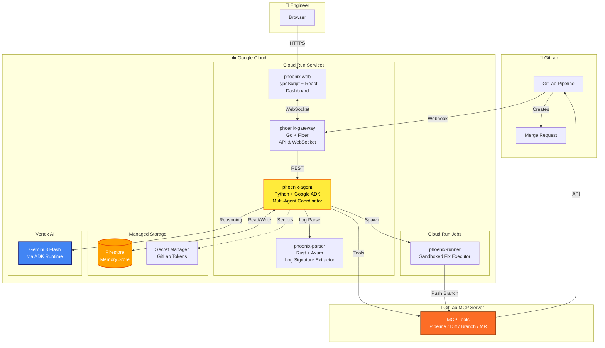
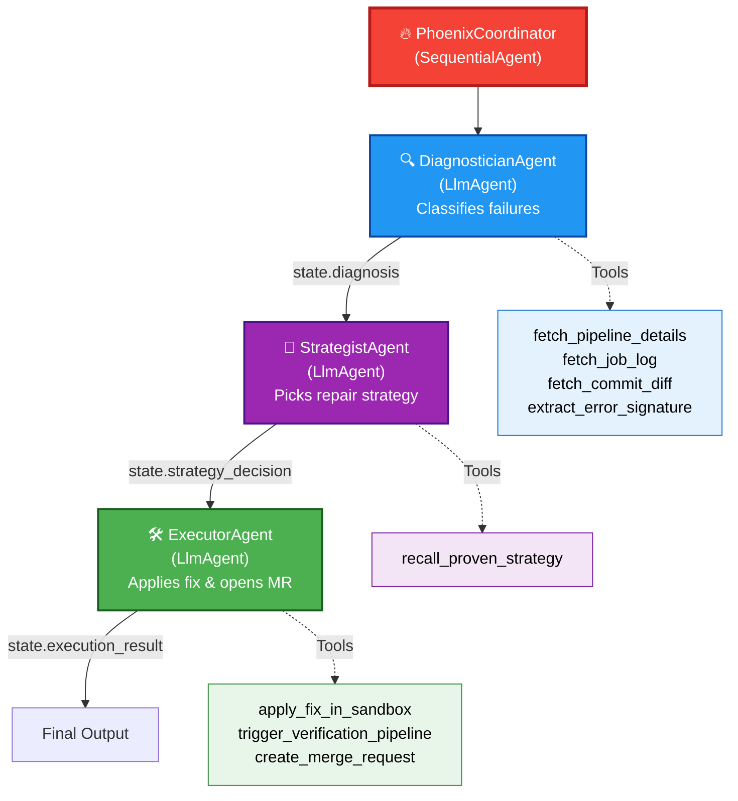
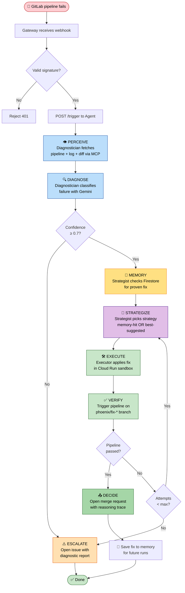
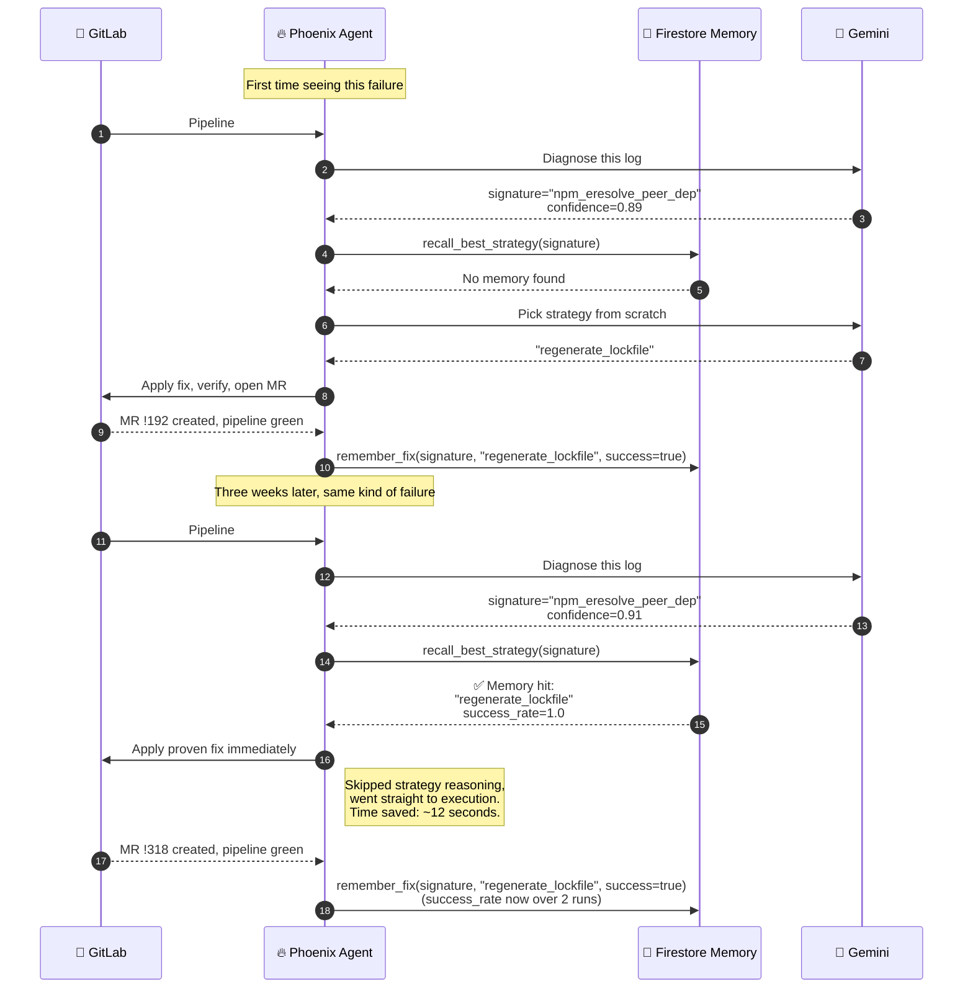

<div align="center">

# 🔥 Phoenix

### An autonomous multi-agent system that diagnoses and repairs broken GitLab CI/CD pipelines without human intervention.

[](https://opensource.org/licenses/MIT)
[](https://cloud.google.com/vertex-ai)
[](https://github.com/google/adk-python)
[](https://cloud.google.com)
[](https://docs.gitlab.com)

[](https://youtu.be/dQw4w9WgXcQ)

**Built by [Wiqi Lee](https://x.com/wiqi_lee) for the Google Cloud Rapid Agent Hackathon 2026**

[🎬 Demo Video](https://youtu.be/dQw4w9WgXcQ) · [🚀 Live Demo](https://phoenix.run.app) · [📖 Architecture](./docs/ARCHITECTURE.md) · [](https://x.com/wiqi_lee)

</div>

---

## 📑 Table of Contents

- [🚨 The Problem](#-the-problem)
- [💥 The Impact](#-the-impact)
- [💡 The Solution](#-the-solution)
- [✨ What Makes Phoenix Different](#-what-makes-phoenix-different)
- [🔭 Long Term Vision](#-long-term-vision)
- [⚙️ How It Works](#%EF%B8%8F-how-it-works)
- [🏗 System Architecture](#-system-architecture)
- [🤖 Multi-Agent Hierarchy](#-multi-agent-hierarchy)
- [🔁 The Reasoning Loop](#-the-reasoning-loop)
- [🧠 Memory and Learning Flow](#-memory-and-learning-flow)
- [🧰 Tech Stack](#-tech-stack)
- [📁 Repository Structure](#-repository-structure)
- [🚀 Getting Started](#-getting-started)
- [⚙️ Configuration](#%EF%B8%8F-configuration)
- [🛠 Supported Failure Categories](#-supported-failure-categories)
- [📜 Hackathon Compliance](#-hackathon-compliance)
- [🎥 Demo](#-demo)
- [📤 Submission Details](#-submission-details)
- [👤 Author](#-author)
- [📜 License](#-license)
- [🙏 Acknowledgements](#-acknowledgements)

---

## 🚨 The Problem

Every engineering team in the world deals with broken CI/CD pipelines. They break at the worst times. They break in the middle of the night. They block deployments, halt releases, and force on-call engineers to drop everything and investigate.

Most of these failures fall into a handful of predictable categories: a dependency was bumped and now the lockfile is out of sync, a linter is unhappy about a new file, a flaky test failed for the third time this week, an environment variable was renamed in the CI config but not in production.

These are not creative problems. They are mechanical problems. They require pattern matching, not deep reasoning. A senior engineer who has seen the same failure twenty times can fix it in under a minute. The bottleneck is not the fix. The bottleneck is waiting for that engineer to wake up, open their laptop, log into GitLab, read the pipeline log, and run the same three commands they ran last time.

This is a problem that an AI agent can solve completely. Not assist with. Solve.

---

## 💥 The Impact

Let's put numbers on this.

A typical engineering team of fifty developers loses roughly **six and a half hours per developer per week** to broken pipelines. That includes the time spent investigating, the time spent context switching back to real work, and the time lost when a deployment gets delayed.

```
50 developers × 6.5 hours/week × 50 weeks/year = 16,250 hours/year
```

At a fully loaded cost of $150 per developer hour, that is **$2.4 million per year** burned on a problem that mostly does not require human judgment.

The cost is not just money. The cost is morale. Engineers did not get into this profession to debug `package-lock.json` at 2 AM. Every hour Phoenix takes back is an hour spent on real work, real learning, real shipping.

---

## 💡 The Solution

Phoenix is an autonomous **multi-agent system** built on the **Google Agent Development Kit (ADK)** and powered by **Gemini 3**, integrated with the **GitLab MCP server**. When a pipeline fails, Phoenix's coordinator agent orchestrates three specialized sub-agents through a complete repair cycle: diagnosis, strategy selection, and execution.

It does this entirely on its own. No one has to wake up. No one has to triage. By the time the on-call engineer checks their phone, the fix is already sitting in their merge request queue, waiting for a quick review.

Phoenix does not replace your engineers. It removes the work they should not have been doing in the first place.

Here is what happens when a pipeline fails:

1. GitLab fires a webhook to Phoenix.
2. The **Diagnostician** sub-agent pulls the failure log, the commit diff, and historical context through MCP tools.
3. The **Strategist** sub-agent consults memory for proven fixes and selects the best repair strategy.
4. The **Executor** sub-agent applies the fix in a Cloud Run sandbox, triggers a verification pipeline, and opens a merge request.
5. If any step fails, the coordinator retries with a different strategy or escalates with a diagnostic report.

The entire process is transparent. Every decision the agents make is streamed live to a dashboard, so engineers can watch the reasoning unfold and audit every action.

---

## ✨ What Makes Phoenix Different

There are plenty of tools in the CI/CD space. There are dashboards, observability platforms, and bots that comment on merge requests. Here is what none of them do that Phoenix does.

### 1. Phoenix takes action. It does not just observe.

Most AI tools in this space tell you what is wrong. Phoenix fixes it. The difference between "your pipeline failed because of X" and "your pipeline was failing because of X and here is the merge request that fixes it" is the difference between a tool and an agent.

### 2. It is a true multi-agent system, not a chat wrapper.

Phoenix uses the Google ADK to compose three specialized LLM agents (Diagnostician, Strategist, Executor) under a SequentialAgent coordinator. Each agent has its own instruction set, its own tools, and its own output schema. This is how modern agentic systems are supposed to be built, not as monolithic prompts but as composed reasoning units.

### 3. Every decision is auditable.

Phoenix streams its reasoning live. Tool calls, tool results, agent transitions, and natural language reasoning are all visible. Engineers do not have to trust a black box. They can watch the agents think and override at any point.

### 4. It learns from your team specifically.

Phoenix stores every successful fix in Firestore, indexed by failure signature and repository. The second time the same kind of failure shows up, the Strategist queries memory first, finds the proven fix, and applies it with high confidence. Time to resolution drops to near zero on recurring issues.

### 5. It is built around safety, not speed.

Phoenix never pushes directly to your main branch. Every fix happens on a new `phoenix/fix-*` branch and arrives as a merge request that a human still reviews. Sandboxed execution means there is no way for the agent to do damage to your real infrastructure. The agent has guardrails baked into its loop at every step.

### 6. It is fully compliant with hackathon requirements by design.

Phoenix is built on Google ADK, runs on Gemini, deeply integrates the GitLab MCP server, and runs entirely on Google Cloud. No third party orchestrators. No competing runtime frameworks. This is what "natively built within the Google Cloud agent ecosystem" looks like in practice.

---

## 🔭 Long Term Vision

The hackathon submission is a starting point. Phoenix is designed to grow into a much bigger system. Here is where it is heading.

### Phase 1: The Hackathon Build (now)

Four built-in strategies, single repository focus, GitLab as the only integration target. This is what ships for the hackathon and what you can run today.

### Phase 2: Broader Integration (next 6 months)

- GitHub Actions support (same agents, different platform adapter)
- Jenkins integration for legacy teams
- Database migration rollback strategies
- Container build failure strategies
- Terraform plan error recovery

### Phase 3: Organization Wide Learning (year 1)

Phoenix becomes a memory layer for an entire engineering organization. A fix that works in one repository becomes a recommendation in every other repository facing the same issue. Cross repo pattern detection means common infrastructure problems get fixed everywhere at once.

### Phase 4: Proactive Mode (year 2)

Phoenix stops waiting for things to break. It analyzes patterns across thousands of pipeline runs and predicts where the next failure will come from. It opens preventative merge requests before anything breaks. Engineering teams stop firefighting entirely.

### Phase 5: Self Improvement (year 2+)

Phoenix grades its own past fixes by long term outcome. Did the merge request get merged? Did it cause regressions later? Did the team find a better fix manually? The agent updates its own strategy preferences based on real outcomes, not just whether the immediate pipeline passed.

This is not a chatbot. This is the first version of something that fundamentally changes how engineering teams operate.

---

## ⚙️ How It Works

At a high level, Phoenix listens for GitLab pipeline failure webhooks, runs a multi-agent reasoning loop, and opens a merge request with the fix. The diagrams below show exactly how the system is laid out and how the agents collaborate.

---

## 🏗 System Architecture

The full deployment architecture across all five services. Everything runs on Google Cloud, with no third party cloud providers used as compute.



**What this diagram shows:** Every request enters through the Go gateway, which fans out to the Python ADK agent. The agent uses Gemini for reasoning, calls MCP tools for GitLab actions, asks the Rust parser to extract log signatures, spawns sandbox jobs to test fixes, and persists everything to Firestore. The React dashboard subscribes to a WebSocket on the gateway to receive a live stream of every agent action.

---

## 🤖 Multi-Agent Hierarchy

Phoenix is built on Google ADK's `SequentialAgent` pattern. The coordinator runs three specialized sub-agents in order, passing structured state between them.



**What this diagram shows:** The coordinator is a `SequentialAgent` that runs three `LlmAgent` sub-agents in order. Each sub-agent has its own Gemini-powered reasoning, its own instruction prompt, and its own toolset. ADK handles state transitions between agents via output keys (`diagnosis`, `strategy_decision`, `execution_result`). The tools shown are all registered as `FunctionTool` instances and exposed to Gemini through ADK's automatic function calling.

---

## 🔁 The Reasoning Loop

This is the full lifecycle of a Phoenix run, from webhook to merge request, with retry logic and escalation paths.



**What this diagram shows:** The full state machine. Note the three critical guardrails: (1) a confidence gate after diagnosis that escalates rather than guessing, (2) a memory lookup that prefers proven fixes over fresh strategies, and (3) a retry loop that tries multiple strategies before giving up. Every successful fix gets persisted to memory so future runs benefit.

---

## 🧠 Memory and Learning Flow

This is what makes Phoenix smarter over time. Memory turns one-off fixes into reusable patterns.



**What this diagram shows:** Memory works by signature. The first time Phoenix sees a failure pattern, it reasons from scratch. Every successful fix is recorded with its signature, strategy, and outcome. The next time the same signature appears, the Strategist queries memory and prefers the proven strategy. Over time, Phoenix becomes faster and more confident on recurring failures specific to your team.

---

## 🧰 Tech Stack

**Mandatory hackathon components:**
- **Google ADK** (Agent Development Kit) - the agent orchestration framework
- **Gemini 3 Flash** via Vertex AI - the reasoning model
- **GitLab MCP Server** - the partner integration

**Languages:**
- Python 3.12 (agent orchestration, sandbox runner)
- Go 1.22 (API gateway with Fiber v2)
- Rust 1.79 (log parser with Axum)
- TypeScript 5 (frontend dashboard)

**Google Cloud services:**
- Vertex AI (Gemini hosting and inference)
- Cloud Run (all five service runtimes)
- Cloud Run Jobs (sandbox execution)
- Firestore (agent memory and run history)
- Cloud Logging (centralized observability)
- Secret Manager (credential storage)
- Artifact Registry (container images)
- Cloud Build (CI for Phoenix itself)

**Frameworks and libraries:**
- Fiber v2 (Go web framework)
- FastAPI (Python HTTP transport, not orchestration)
- React 18 + Vite (frontend build)
- Tailwind CSS (styling)
- Tokio + Axum (Rust async runtime)

---

## 📁 Repository Structure

```
Phoenix/
├── README.md                   # You are here
├── LICENSE                     # MIT
├── .env.example                # Configuration template
├── docker-compose.yml          # Local development stack
├── Makefile                    # Common commands
│
├── apps/
│   ├── agent/                  # Python + Google ADK (the brain)
│   │   ├── src/phoenix_agent/
│   │   │   ├── adk_agents.py   # Multi-agent definitions
│   │   │   ├── main.py         # FastAPI HTTP layer
│   │   │   ├── tools/          # ADK FunctionTools
│   │   │   ├── strategies/     # Fix strategy implementations
│   │   │   ├── memory.py       # Firestore client
│   │   │   └── gitlab_mcp.py   # GitLab MCP wrapper
│   │   └── tests/
│   │
│   ├── gateway/                # Go + Fiber (API gateway)
│   ├── parser/                 # Rust + Axum (log parser)
│   ├── runner/                 # Python (sandbox executor)
│   └── web/                    # TypeScript + React (dashboard)
│
├── infra/
│   └── scripts/
│       ├── setup-gcp.sh        # One time GCP setup
│       ├── deploy-all.sh       # Deploy to Cloud Run
│       └── seed-demo-data.sh   # Create demo GitLab repo
│
└── docs/
    ├── ARCHITECTURE.md         # Deep architecture doc
    ├── DEMO_SCRIPT.md          # Demo video script
    └── SUBMISSION.md           # Devpost submission text
```

---

## 🚀 Getting Started

### Prerequisites

```bash
# Required tools (versions are minimums)
python --version    # 3.12+
go version          # 1.22+
rustc --version     # 1.79+
node --version      # 20+
docker --version    # any recent version
gcloud --version    # any recent version
```

You also need:
- A Google Cloud project with billing enabled (the $100 hackathon credit covers this)
- A GitLab account with a personal access token that has `api` scope

### One time setup

```bash
git clone https://github.com/wiqi-lee/Phoenix.git
cd phoenix
cp .env.example .env
# Edit .env with your real values
./infra/scripts/setup-gcp.sh
```

The setup script enables required APIs, creates service accounts, and configures Secret Manager.

### Local development

```bash
make dev
```

This brings up all services through `docker-compose`. The dashboard becomes available at **http://localhost:5173**.

### Deploy to Cloud Run

```bash
make deploy
```

The script prints the public URL when it finishes.

### See all commands

```bash
make help
```

---

## ⚙️ Configuration

Phoenix reads configuration from environment variables. The full list is in `.env.example`.

| Variable | Description | Required |
|----------|-------------|----------|
| `GCP_PROJECT_ID` | Your Google Cloud project ID | Yes |
| `GCP_REGION` | Region for all services | Yes |
| `GITLAB_TOKEN` | Personal access token with `api` scope | Yes |
| `GITLAB_BASE_URL` | GitLab instance URL | Yes |
| `GEMINI_MODEL` | Model name (default: `gemini-3-flash`) | No |
| `AGENT_CONFIDENCE_THRESHOLD` | Minimum confidence to act (default: `0.7`) | No |
| `MAX_RETRY_STRATEGIES` | Strategies to try before escalating (default: `3`) | No |

---

## 🛠 Supported Failure Categories

Phoenix ships with four built-in fix strategies. Each one is a self contained Python module that the Executor agent can invoke through a tool call.

| Category | Strategy | What it does |
|----------|----------|--------------|
| `dependency_conflict` | `regenerate_lockfile` | Regenerates `package-lock.json`, `yarn.lock`, `pnpm-lock.yaml`, `requirements.txt`, `go.sum`, or `Cargo.lock` depending on the detected package manager |
| `lint_error` | `auto_format` | Runs `eslint --fix`, `prettier --write`, `ruff check --fix`, `black`, `gofmt`, `rustfmt`, or `cargo clippy --fix` |
| `flaky_test` | `quarantine_flaky_test` | Detects inconsistent pass/fail patterns and quarantines the test with a framework-appropriate skip directive |
| `config_error` | `fix_ci_yaml` / `fix_env_var` | Repairs malformed `.gitlab-ci.yml`, missing environment variables, cache misconfigurations, and invalid job dependencies |

Adding a new strategy is straightforward. Implement the `Strategy` protocol and register it in `strategies/__init__.py`. The Executor agent picks it up automatically through the `apply_fix_in_sandbox` tool.

---

## 📜 Hackathon Compliance

Phoenix is built specifically to satisfy every requirement of the Google Cloud Rapid Agent Hackathon. This section documents how.

| Requirement | How Phoenix satisfies it |
|-------------|--------------------------|
| **Powered by Gemini** | All three sub-agents (Diagnostician, Strategist, Executor) use `gemini-3-flash` via Vertex AI through ADK |
| **Built within Google Cloud agent ecosystem** | Uses Google ADK as the orchestration framework, not any third-party framework like LangChain, CrewAI, or AutoGen |
| **Integrates partner MCP server** | The Diagnostician and Executor agents call GitLab MCP tools to fetch pipeline data, read diffs, create branches, and open merge requests |
| **No competing orchestrators** | Phoenix uses ADK's `SequentialAgent`, `LlmAgent`, and `FunctionTool` directly. FastAPI is used only as an HTTP transport for webhook intake, not for agent orchestration |
| **Runs on web platform** | The React dashboard runs in a browser and is served from Cloud Run |
| **Open source with detectable license** | MIT License file at the repository root |
| **Public repository** | Available at [github.com/wiqilee/Phoenix](https://github.com/wiqilee/Phoenix) |
| **Demo video under 3 minutes** | [Available on YouTube](https://youtu.be/dQw4w9WgXcQ) |

---

## 🎥 Demo

A three minute walkthrough is on YouTube: **[Watch the Phoenix Demo](https://youtu.be/dQw4w9WgXcQ)**

The demo covers:

1. A real GitLab pipeline failing on a dependency conflict
2. Phoenix detecting the failure through a webhook
3. The reasoning trace streaming live to the dashboard
4. A sandboxed fix being applied
5. The verification pipeline going green
6. A merge request appearing in GitLab with full context

To reproduce the demo locally:

```bash
make seed
```

This creates a demo repository in your GitLab account with intentionally broken CI configurations.

---

## 📤 Submission Details

**Hackathon:** Google Cloud Rapid Agent Hackathon, GitLab track
**Devpost:** [rapid-agent.devpost.com](https://devpost.com/software/phoenix-g5eqpj)
**Demo video:** [https://youtu.be/dQw4w9WgXcQ](https://youtu.be/dQw4w9WgXcQ)
**Live demo:** [https://phoenix.run.app](https://phoenix.run.app)
**GitHub:** [github.com/wiqilee/Phoenix](https://github.com/wiqilee/Phoenix)

### Required components checklist

- [x] Built with Gemini and Google ADK
- [x] Integrates GitLab MCP server deeply (both read and write operations)
- [x] Runs on web platform (Cloud Run + React dashboard)
- [x] New project created during the contest period (May 5 - June 11, 2026)
- [x] Public GitHub repository
- [x] MIT license file at repository root, detectable from the About section
- [x] Three minute demo video on YouTube
- [x] Written description on Devpost
- [x] Hosted URL for judging

See [`docs/SUBMISSION.md`](./docs/SUBMISSION.md) for the full Devpost description.

---

## 👤 Author

**Wiqi Lee**

[](https://x.com/wiqi_lee)
[](https://github.com/wiqi-lee)

Built solo for the Google Cloud Rapid Agent Hackathon 2026. If you want to talk about Phoenix, agentic AI, or CI/CD automation, find me on X.

---

## 📜 License

Phoenix is released under the [MIT License](./LICENSE). The license file is at the root of this repository, which makes it detectable from the GitHub About section as the hackathon rules require.

---

## 🙏 Acknowledgements

Built with:

- **Google Agent Development Kit (ADK)** - the code-first framework for building multi-agent systems
- **Gemini 3** and **Vertex AI** - the reasoning engine
- **GitLab MCP Server** - the partner integration that makes deep GitLab access possible
- The open source community behind **Fiber**, **FastAPI**, **React**, **Tokio**, **Axum**, and many others

Special thanks to the Google Cloud Partnerships team for running this hackathon and giving solo builders a serious platform to ship on.

---

<div align="center">

**🔥 Phoenix. Rise from the ashes.**

Made with caffeine and conviction by [Wiqi Lee](https://x.com/wiqi_lee)

[](https://x.com/wiqi_lee)
[](https://youtu.be/dQw4w9WgXcQ)
[](https://devpost.com/software/phoenix-g5eqpj)

</div>
