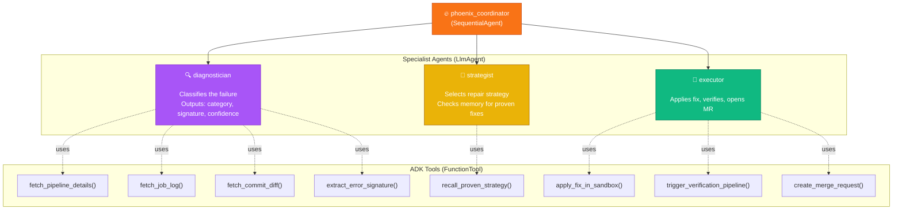
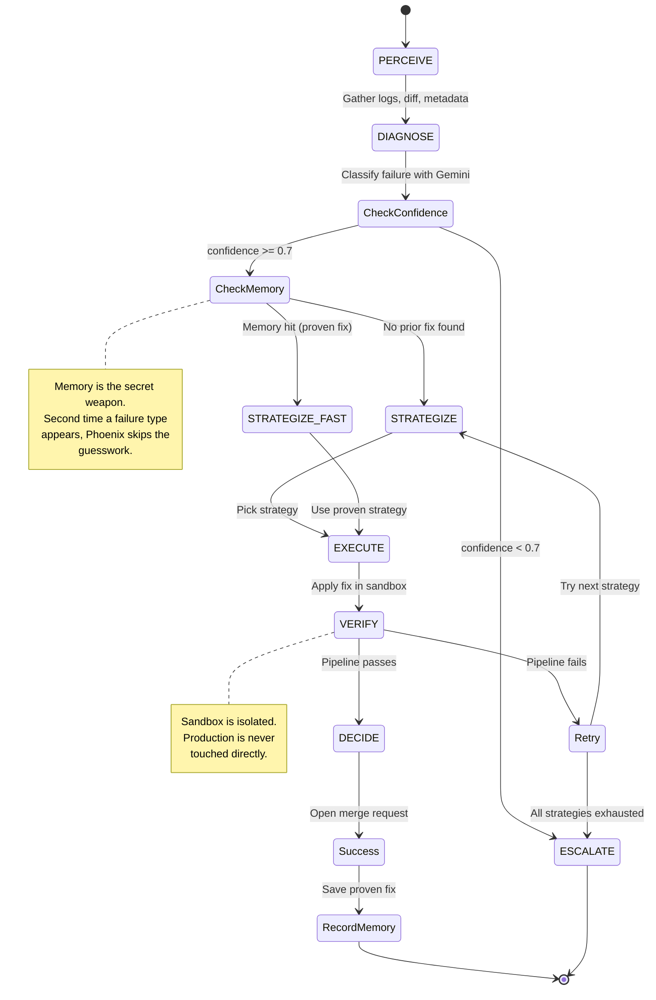
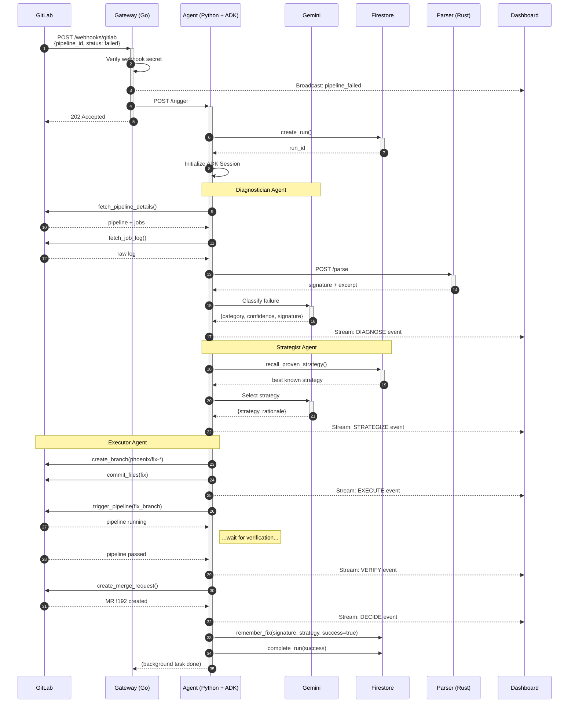
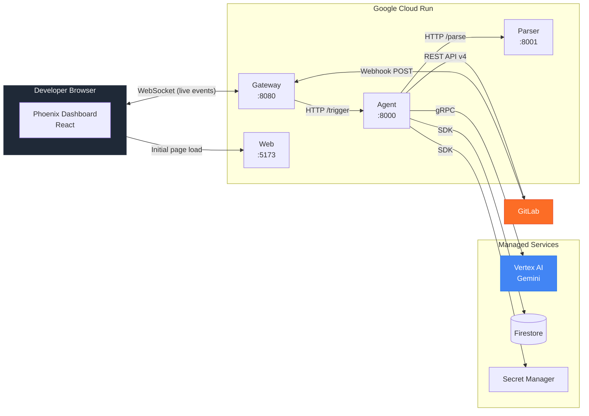
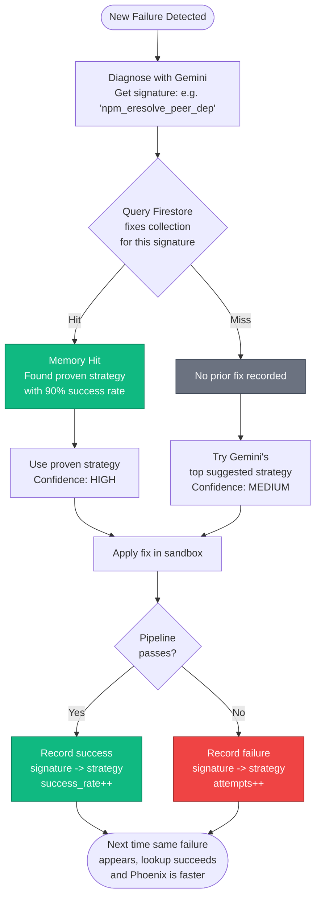
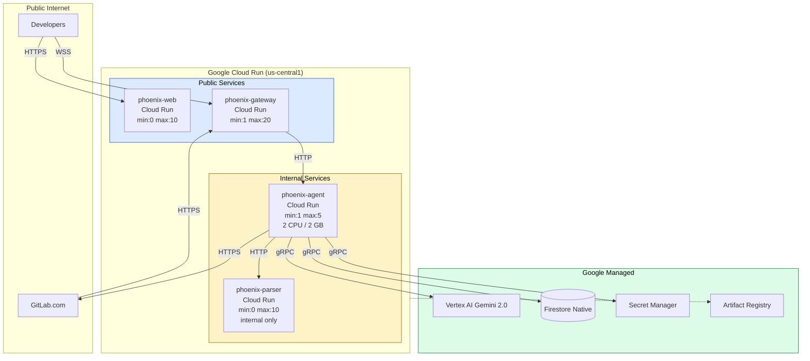
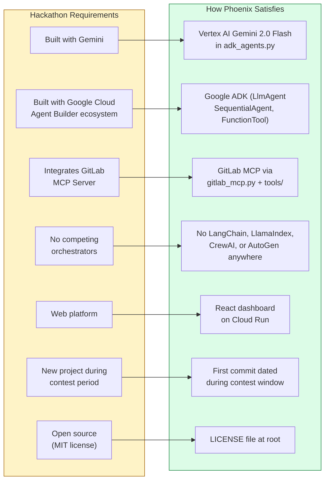

# 🏗 Phoenix Architecture

> Deep technical documentation of how Phoenix works, with diagrams.

This document explains the full Phoenix architecture, from the moment a GitLab pipeline fails to the moment a merge request appears with a fix. Every diagram below is a Mermaid diagram and renders directly on GitHub.

---

## Table of Contents

- [System Overview](#system-overview)
- [The Multi-Agent Hierarchy](#the-multi-agent-hierarchy)
- [The Reasoning Loop](#the-reasoning-loop)
- [Request Flow: From Webhook to Merge Request](#request-flow-from-webhook-to-merge-request)
- [Service Communication](#service-communication)
- [Memory and Learning Flow](#memory-and-learning-flow)
- [Deployment Topology](#deployment-topology)
- [Compliance with Hackathon Rules](#compliance-with-hackathon-rules)

---

## System Overview

Phoenix is composed of five services. The agent service is the only one that does AI reasoning. The other four exist to support it: routing traffic, parsing logs, streaming updates to humans, and storing memory.

```mermaid
graph TB
    subgraph External["External Systems"]
        GitLab["GitLab.com<br/>Pipeline Failures"]
        Developer["Developer<br/>Watching Dashboard"]
    end

    subgraph GoogleCloud["Google Cloud Run"]
        Web["phoenix-web<br/>(React + Vite)"]
        Gateway["phoenix-gateway<br/>(Go + Fiber)"]
        Agent["phoenix-agent<br/>(Python + ADK)"]
        Parser["phoenix-parser<br/>(Rust + Axum)"]
    end

    subgraph GoogleAI["Google Cloud AI"]
        Gemini["Gemini 2.0<br/>via Vertex AI"]
        ADK["Agent Development Kit<br/>(Orchestration)"]
    end

    subgraph Storage["Google Cloud Storage"]
        Firestore["Firestore<br/>Run History + Memory"]
        Secrets["Secret Manager<br/>Tokens"]
    end

    GitLab -- "1. Webhook: pipeline failed" --> Gateway
    Gateway -- "2. Trigger agent" --> Agent
    Agent <-- "ADK Runtime" --> ADK
    ADK <-- "LLM calls" --> Gemini
    Agent -- "Parse log" --> Parser
    Agent -- "Store memory" --> Firestore
    Agent -- "Get secrets" --> Secrets
    Agent -- "5. Create MR" --> GitLab
    Gateway -- "3. Stream events" --> Web
    Web -- "4. Live trace" --> Developer

    style Gemini fill:#4285F4,stroke:#1a73e8,color:#fff
    style ADK fill:#34a853,stroke:#137333,color:#fff
    style Agent fill:#fbbc04,stroke:#ea8600,color:#000
    style GitLab fill:#fc6d26,stroke:#e24329,color:#fff
```



**Key design decisions:**

- **Multi-language by purpose.** Python for AI work (ADK is Python-first), Go for high-throughput HTTP and WebSocket fanout, Rust for the log parser where regex speed matters, TypeScript for the dashboard. Each language is used where it excels.
- **One cloud, one ecosystem.** Every service runs on Google Cloud Run. No third party orchestrators. This is both a hackathon rule and a clean architecture choice.
- **ADK is the orchestrator.** No LangChain, no LlamaIndex, no AutoGen, no CrewAI. The Google Agent Development Kit handles all multi-agent coordination.

---

## The Multi-Agent Hierarchy

Phoenix is a multi-agent system built using the ADK's `SequentialAgent` pattern. The coordinator runs three specialist agents in order, passing state between them.



Each agent has:

1. **A focused instruction prompt** that defines its role
2. **A set of tools** it can call to gather information or take action
3. **A typed output** that flows to the next agent via ADK session state

This is the modern way to build agentic systems. The ADK handles state passing, tool invocation, retry logic, and observability natively.

---

## The Reasoning Loop

The classic six-step Phoenix loop. Each box is a phase that streams to the dashboard live so engineers can watch the agent work.



**Why this shape works:**

- **Confidence gates prevent embarrassment.** Phoenix would rather escalate than apply a wrong fix.
- **Memory shortens the loop over time.** Every successful fix teaches the next run.
- **Retry with different strategies is bounded.** Three attempts max, then escalate. No infinite loops.
- **Every transition is observable.** Each arrow in the diagram corresponds to an event streamed to the dashboard.

---

## Request Flow: From Webhook to Merge Request

This is the full happy path, end to end. Read it top to bottom.



Every numbered arrow is a real network call. The total time, in practice, is two to five minutes for most pipeline failures.

---

## Service Communication

Inside the Phoenix cluster, services talk over HTTP. The dashboard talks to the gateway via WebSocket. Gemini calls go over gRPC. Firestore over its own SDK.



**Protocols summary:**

| From | To | Protocol | Why |
|------|-----|----------|-----|
| GitLab | Gateway | HTTPS POST | Webhook standard |
| Gateway | Agent | HTTP POST | Simple internal RPC |
| Agent | Parser | HTTP POST | Fast, easy debugging |
| Agent | Gemini | gRPC | Vertex AI SDK default |
| Agent | Firestore | gRPC | Firestore SDK default |
| Dashboard | Gateway | WebSocket | Real time streaming |

---

## Memory and Learning Flow

Phoenix gets smarter with every run. The memory subsystem is what makes that possible.



**Firestore schema for `phoenix_fixes` collection:**

```typescript
{
  project_id: string,           // GitLab project path
  signature: string,            // From the parser, e.g. "npm_eresolve_peer_dep"
  strategy: string,             // Name of strategy that was tried
  attempts: number,             // How many times this combo has been tried
  successes: number,            // How many times it worked
  success_rate: number,         // successes / attempts
  first_seen: timestamp,
  last_seen: timestamp,
  last_ttr: number              // Last time-to-resolution in seconds
}
```

The combination `(project_id, signature)` is what makes memory team-specific. A fix that works at company A might not work at company B if their codebases differ. Phoenix respects that.

---

## Deployment Topology

All five services run on Cloud Run. Each is independently scalable. The agent and parser scale based on incoming work. The gateway scales based on dashboard connections.



**Scaling characteristics:**

- **Agent service** is the bottleneck because each run takes 2 to 5 minutes. Set `min_instances: 1` so the first webhook does not pay cold start cost.
- **Parser** is stateless and fast, can scale to zero between bursts.
- **Gateway** keeps WebSocket connections open, so it needs `min_instances: 1` whenever there are active dashboard users.
- **Web** is just static assets and an initial bundle, scales to zero happily.

---

## Compliance with Hackathon Rules

Phoenix is built to satisfy every mandatory hackathon requirement. This section maps the rules to the architecture.



**What is intentionally absent from Phoenix:**

- ❌ LangChain (third party orchestrator)
- ❌ LlamaIndex (third party orchestrator)
- ❌ AutoGen (third party orchestrator)
- ❌ CrewAI (third party orchestrator)
- ❌ Vercel, Netlify, AWS Lambda, Azure Functions (competing cloud platforms)
- ❌ OpenAI API, Anthropic API, Cohere API (competing AI providers)

**What Phoenix uses:**

- ✅ Google ADK (Agent Development Kit) for all orchestration
- ✅ Vertex AI Gemini 2.0 Flash for all reasoning
- ✅ Google Cloud Run for all compute
- ✅ Google Firestore for all state
- ✅ GitLab MCP server + REST API for partner integration

---

## File-Level Reference

For developers reading the source, here is where to find each architectural concept in code:

| Concept | File |
|---------|------|
| Multi-agent definition | `apps/agent/src/phoenix_agent/adk_agents.py` |
| GitLab tools (MCP integration) | `apps/agent/src/phoenix_agent/tools/gitlab_tools.py` |
| Parser tools | `apps/agent/src/phoenix_agent/tools/parser_tools.py` |
| Fix strategies | `apps/agent/src/phoenix_agent/strategies/` |
| Firestore memory | `apps/agent/src/phoenix_agent/memory.py` |
| HTTP entry point | `apps/agent/src/phoenix_agent/main.py` |
| Webhook handler | `apps/gateway/internal/webhook/handler.go` |
| WebSocket hub | `apps/gateway/internal/websocket/hub.go` |
| Log signature extraction | `apps/parser/src/main.rs` |
| Dashboard trace view | `apps/web/src/components/ReasoningTrace.tsx` |

---

Made by [Wiqi Lee](https://x.com/wiqi_lee) for the Google Cloud Rapid Agent Hackathon 2026.
